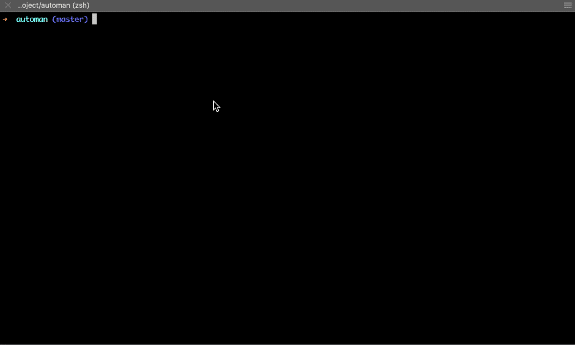

# Automan

<!-- [](https://coveralls.io/github/YYCoder/automan?branch=master)
[](https://travis-ci.org/YYCoder/automan.svg?branch=master) -->

Automate your workflow by configuration and template, free yourself from annoying repetitive work.


## Installation

## Basic Usage
Automan is a command line tool, which takes a configuration as input and generates questions to get data from user to continue its work. So, basically, you do this `automan -c [automan configuration file path]` to get the questions, and answer them, that's it !

There are two types of workflows that Automan provided, one called `generate` and the other called `modify`.

As it mentioned above, Automan takes a configuration as input, so you have to write your Automan configuration first, to define what kind of work you need it to do. A basic configuration is like below:

```json
{
    "name": "workflow name",
    "description": "workflow description",
    "props": [
        {
            "name": "name",
            "type": "string",
            "description": "some question",
            "validate": ["ascii"]
        }
    ],
    "generate": {},
    "modify": []
}
```

As you can see, it is an empty configuration, because it doesn't define any workflow, but the structure is tangible. Let's define a simple generate workflow then.

```json
{
    "name": "workflow name",
    "description": "workflow description",
    "props": [
        {
            "name": "name",
            "type": "string",
            "description": "name of component",
            "validate": ["ascii"]
        },
        {
            "name": "type",
            "type": "list",
            "description": "type of component",
            "prompt": [
                {
                    "value": "class",
                    "name": "Class"
                },
                {
                    "value": "function",
                    "name": "Function"
                }
            ]
        }
    ],
    "generate": {
        "output": {
            "type": "path",
            "description": "path to the generated component",
            "validate": ["path"]
        },
        "rules": [
            {
                "template": {
                    "prop": "type",
                    "value": {
                        "class": "template/class.ts",
                        "function": "template/function.ts"
                    }
                },
                "rename": "__name__/index.tsx"
            },
            {
                "template": "template/style.less",
                "rename": "__name__/style.less"
            }
        ]
    },
    "modify": []
}
```

This one is more complicated but pretty straightforward though.

It defines two questions which are component name and component type. The component name question has defined a internal validate method calld `ascii`, which will validate the answer must be a ascii string. The component type question is more interesting, it will generate a selection list which contains the selection you specified above. Each of these questions has a name field, which is used to reference its data later.

The `generate` part defines how to generate files, including where to output files and where the template is.

The output field is obviously used to define where the files should be generated, and the rules field is more important, it defines how many files should be generated and where are the templates.

Following is the result of this configuration:



## Command-Line API
* **-f, --force**: By default, Automan will check whether there are unstaged changes in current repository, if true, it will refuse to continue. Using this option, it will override the default behavior

* **-d, --dryrun**: Only print the result, won't emit any changes to filesystem. This option mostly used to test if the configuration is correct

* **-m, --mode <mode>**: Automan has two different interact mode
  * **interact**: Default option, will generate the interactive prompts to get answers
  
  * **command**: Won't generate prompts, you have to provide the `props` option to pass answers to Automan, and it will instantly do the job

* **-c, --config <config>**: Most important option, specify where the configuration file resides, absolute path or relative path which relative to `process.cwd()`

* **-p, --props <props>**: As it mentioned above, when you specified `command` for interact mode, you must pass this option to pass answers to Automan. The value is formatted as `name=haha,type=class`.

## Configuration
Automan is a configuration-driven tool, so the most important part of it is how to configure it.

### Glossary
* **path-placeholder**: identifier in path-like string wrapped by two underscores for each side (e.g. `__name__/dir` is `__name__`). Automan will substitute it with the value of name field in questions.

* **code-unit**: 

### General Config
* **name**: the workflow's name

* **description**: the workflow's description

* **props**: the workflow's array of questions, which answers you can use in templates and generated files path and any other steps
  * **name**: question name, used to reference its value from answers

  * **type**: question type, currently includes `'string' | 'list' | 'path'`
    * **string**: just type the answer
    
    * **list**: you must provide `prompt` option to specify the selection list
    
    * **path**: will load all the folders inside current working dictionary and generate a selection list for you, exclude `node_modules`

  * **description**: question description displays on terminal

  * **validate**: array of validate functions, currently provided four internal validators `'ascii' | 'path' | 'number' | 'boolean'`
  
  * **prompt**: array of selections used by `type: 'list'` question, contains `value` and `name` field

### Generate
* **output**: properties as same as question in `props` option, but without `name` field
  > This option is required if you want to generate files, and it is used by all rules below which doesn't have its own `output` option

* **extraDir**: sometimes you want to generate files in a new folder, this option lets you achieve that by specifying a path like string (e.g. `foo/bar`)

    > available for using **path-placeholder**.

* **rules**: array of config of files to generate
  * **template**: there are two types of value
    * **string**: the path to template file, **relative to configuration file path**
    
    * **object**: in order to use some value from answers
      * **prop**: the question name
      
      * **value**: a map of question value to template path, **relative to configuration file path**
  
  * **output**: same as the `output` option above, but used for single file exclusively, if the rule has a `output` option itself, it will override the `output` option in `generate` option
  
  * **rename**: by default, it will use the template name as the generated file name, if you want to change it, or make a new folder to contain the generated file, this option let you do that.

    > just like `extraDir` option, you can use **path-placeholder** in this option as well.

### Modify
The `modify` options takes an array of configurations that modify the files uses the specified transformer, and different transformer uses different configuration. I'll show you general configuration and list every transformer's configuration as follows:

* **general configuration**
  * **file**: where the file needs to be transformed resides, both absolute path and relative path make sense
  
  * **rules**: an array of transformer configurations applied to the file
    * **transformer**: name of the transformer, the one and only required option in each rule, rest options are defined by transformer

* **transformer configurations**
  * **AddCallChain**: add a function call to a call chain

      ```js
      router.add('/test')
      
      // into

      router.add('/test').add('new_route')
      ```

    * **func**: identifier for the function to call, `add` for above example
    
    * **root**: for simplicity, Automan add call to the root of the call chain, there are three types of call chain in general:
      * `router.add()`: the root is `router`
      
      * `router.route.add()`: the root is `route`
      
      * `router().add()`: the root is `router`

    * **args**: arguments for the function call, both **literal** and **code-unit** are available

## Unit Testing

`npm run test` or `yarn test` will run the unit tests, using Jest as a runner and test framework.

> Don't forget to run `yarn clear` or `npm run clear` first then run the test script, or the test coverage result would be wrong.

## Motivation
Mostly, we will face some situations that are completely pointless, only makes you typing all the time. For example, when adding a page or adding a component. First, you make a new file, then, you write a lot of template code like below (as a front-end developer):

```jsx
import React from 'react';

export default class extends React.Component {
    state = {}

    render() {
        return ();
    }
}
```

This is annoying that it doesn't mean anything, only some template code, and this is a immensely simple example, most time it's even worse, you have to make a stylesheet and import it to your component, if you are adding a page, you might have to modify your routes config, etc.

As a engineer, we shouldn't be bothered by such things, it only lead us to [RSI](http://en.wikipedia.org/wiki/Repetitive_strain_injury).

So, here comes Automan, which goal is free you from pointless typing as much as possible, the best case is you don't have to worry about making a new file or modifying some config at all, just answer some simple questions and Automan will take care of it for you.

## Difference Between Code Snippet Tool
Automan is focusing on automate workflow other than using shortcuts to write code faster, including making new file from template, modifying files. Although the goal both are make developers work faster, type less, but I believe Automan is more handy after you get familiar with it.


## TODO

- [ ] add array element transformer
- [ ] add object property transformer
- [ ] add class property transformer
- [ ] add JSX element transformer
- [ ] hook system

 