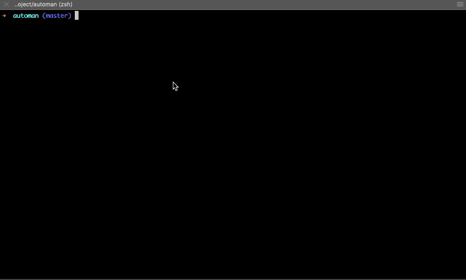

# Automan

[](https://coveralls.io/github/YYCoder/automan?branch=master)
[](https://travis-ci.org/YYCoder/automan.svg?branch=master)

[English](../README.md)

通过配置和模板自动化工作流，从重复性工作中解放双手 🚀。

## Installation
TODO:

## Basic Usage
Automan 是一个命令行工具，它接收配置文件作为输入并生成相应问题来根据用户需求生成代码。
所以，基本上你只需要编写配置、输入以下命令即可！剩下的交给 Automan 来完成！

`automan -c [automan configuration file path]`

Automan 提供两种不同的工作流，一种是 `generate` 一种是 `modify`。

正如上面所说，Automan 接收配置文件作为输入，所以你必须先编写你的配置，并定义好你需要让它完成什么样的工作流。一个基本的配置文件如下：

```json
{
    "name": "workflow name",
    "description": "workflow description",
    "props": [
        {
            "name": "name",
            "type": "string",
            "description": "some question",
            "validate": ["ascii"]
        }
    ],
    "generate": {},
    "modify": []
}
```

正如你看到的，这是一个空的配置文件，因为它没有配置任何工作流，但是这个结构足够清晰了吧？接下来让我们定义一个简单的生成工作流：

```json
{
    "name": "workflow name",
    "description": "workflow description",
    "props": [
        {
            "name": "name",
            "type": "string",
            "description": "name of component",
            "validate": ["ascii"]
        },
        {
            "name": "type",
            "type": "list",
            "description": "type of component",
            "prompt": [
                {
                    "value": "class",
                    "name": "Class"
                },
                {
                    "value": "function",
                    "name": "Function"
                }
            ]
        }
    ],
    "generate": {
        "output": {
            "type": "path",
            "description": "path to the generated component",
            "validate": ["path"]
        },
        "rules": [
            {
                "template": {
                    "prop": "type",
                    "value": {
                        "class": "template/class.ts",
                        "function": "template/function.ts"
                    }
                },
                "rename": "__name__/index.tsx"
            },
            {
                "template": "template/style.less",
                "rename": "__name__/style.less"
            }
        ]
    },
    "modify": []
}
```

这个例子相对来说更复杂一点，但它依然很直观。

首先，它定义了两个问题，分别是 组件名称 和 组件类型，组件名称的问题使用了一个内部校验的方法 `ascii`，它会校验输入是否为一个 ascii 字符串。组件类型的问题则更有意思，它会生成一个选项列表。每一个问题都有一个 name 字段，该字段是用来在后面引用用户输入的数据的。

`generate` 部分定义了如何去生成文件，包括在哪里生成以及模板文件在哪。

output 字段很明显就是用来定义在哪生成的，rules 字段则更加重要，它定义了有多少文件需要生成以及每个文件的模板在哪。

如下是根据这个配置文件生成的结果：



> 如果你有任何问题，你可以看看 `examples` 目录。

## 命令行 API
* **-f, --force**: 默认情况下，Automan 会检查当前仓库下是否为未提交的改动，若存在，则会拒绝进入之后的流程。使用这个选项，你可以忽略这种行为

* **-d, --dryrun**: 只输出结果，但不会将任何输出写入文件系统。这种选项通常用来测试配置是否正确

* **-m, --mode <mode>**: Automan 有两种不同的交互模式
  * **interact**: 默认模式，会生成交互式的提问来接收用户输入
  
  * **command**: 不会生成提问，你必须提供 `props` 选项来将所有回答传入，Automan 会直接执行生成工作

* **-c, --config <config>**: 最重要的选项，定义了配置文件在哪，可以是绝对路径也可以是相对于 `process.cwd()` 的相对路径

* **-p, --props <props>**: 正如以上所说，当你把 `mode` 选项设置为 `command` 后，你必须传入该选项。值是类似 `name=haha,type=class` 的字符串

## 术语表

### ejs 模板
Automan 使用 [ejs](https://ejs.bootcss.com/) 作为模板引擎，你既可以在模板文件中使用也可以在 transformer 配置中使用它，后面会说到。

### 路径替换符
在路径字符串中由双下划线包裹的标识符，如 `__name__/dir` 中就是 `__name__`。Automan 会自动替换掉里面的标识符为它在用户输入中的值。

### 字面量
字面量如数值字面量 `123`，字符串字面量 `'foo'`，布尔值字面量 `true`，以及 `null`，其他字面量如对象、数组，都会被直接拷贝到生成的代码中。

> 如果你想使用用户输入的答案，你也可以直接使用 ejs 模板如 `<%= arg %>`，**但它只能生成字符串字面量**。

### 代码单元
由于字面量无法表达所有场景，比如，如果你想生成一个由用户回答中的值组成的标识符，使用 ejs 模板则只能生成字符串。因此，我们提供了一个更强大的方式来生成代码 —— 代码单元。

代码单元就是一个普通的对象，它包括 `__type__` 属性和 `value` 属性，需要的话它也可以是嵌套结构，它的值也可以是 ejs 模板。

  * **属性**
    * **__type__**: 代码单元的标记，当 Automan 发现一个存在 `__type__` 属性的对象时，它就会认为这是一个代码单元，有如下若干种可用的代码单元：
      
      ```typescript
      interface CodeUnitString {
          __type__: 'string';
          value: string;
      }
      interface CodeUnitNumber {
          __type__: 'number';
          value: number;
      }
      interface CodeUnitBoolean {
          __type__: 'boolean';
          value: boolean;
      }
      interface CodeUnitNull {
          __type__: 'null';
          value: null;
      }
      interface CodeUnitUndefined {
          __type__: 'undefined';
          value: undefined;
      }
      interface CodeUnitObj {
          __type__: 'obj';
          value: CodeUnitObject;
      }
      interface CodeUnitArr {
          __type__: 'arr';
          value: CodeUnitArray;
      }
      interface CodeUnitVar {
          __type__: 'var';
          value: string;
      }
      ```
    
    * **value**: 代码单元的值，可以是字面量、数组、对象等等

  * **examples**: 话不多说，先看代码 😁. 如下列出了一些基本的例子，我们先假设配置中定义了两个问题，包括 `arg1` 和 `arg2`，它们的值分别是 `'foo'` 和 `'bar'`
    * **生成一个变量**:

        ```json
        {
            "__type__": "var",
            "value": "<%= `${arg1}-${arg2}` %>"
        }
        ```

        to

        ```js
        foo-bar
        ```
    
    * **生成字符串**: 它会生成字符串，而不是一个标识符

        ```json
        {
            "__type__": "string",
            "value": "<%= `${arg1}-${arg2}` %>"
        }
        ```

        to

        ```js
        "foo-bar"
        ```

        > 如果你只是想生成一个使用 ejs 模板的字符串，你可以直接用字符串字面量，如 `<%= arg1 + '-' + arg2 %>`，与上面的例子有相同的结果。
    
    * **生成对象**: 下例是一个递归的代码单元，`other` 属性就是一个 `__type__` 是 `string` 的代码单元

        ```json
        {
            "__type__": "obj",
            "value": {
                "name": "hahaah",
                "test": "<%= `${arg1}${arg2}` %>",
                "other": {
                    "__type__": "string",
                    "value": "<%= arg1 %>"
                }
            }
        }
        ```

        to

        ```js
        {
            name: "hahaah",
            test: "foobar",
            other: "foo"
        }
        ```
    
    * **生成数组**: 会生成一个数组字面量，并且转换内部的代码单元为指定的类型

        ```json
        {
            "__type__": "arr",
            "value": [
                123,
                {
                    "__type__": "string",
                    "value": "<%= arg1 %>"
                },
                {
                    "__type__": "number",
                    "value": "<%= arg2 %>"
                },
                {
                    "__type__": "boolean",
                    "value": "<%= arg1 %>"
                }
            ]
        }
        ```

        to

        ```js
        [123, "foo", NaN, true]
        ```

### 校验器
一批用于校验用户输入的函数，目前支持如下四种校验器 `'ascii' | 'path' | 'number' | 'boolean'`。

### 转换器
用于根据配置对指定代码进行修改的 class。

## 配置
Automan 是一个配置驱动的工具，因此掌握如何配置它才是最重要的。

### 通用配置
* **name**: 工作流的名称

* **description**: 工作流的描述

* **props**: 工作流相关的问题，数组类型，问题的答案可以用在模板及生成文件路径等其他步骤中
  * **name**: 问题名称，用于在之后引用其值

  * **type**: 问题类型，目前包括 `'string' | 'list' | 'path'`
    * **string**: 字符串类型，直接输入回答即可
    
    * **list**: 会生成一个选项列表，可以让用户选择，你必须提供 `prompt` 来指定生成的选项列表
    
    * **path**: 类似 `list`，但是它无需 `prompt` 属性，它会自动读取当前工作目录下的所有目录，并生成相应的选项列表，同时支持模糊匹配。但注意，它是排除 `node_modules` 的

  * **description**: 终端上展示的问题描述

  * **validate**: 校验器数组
  
  * **prompt**: 当问题类型为 `type: 'list'`，该属性指定需要生成的选项列表，每个选项包括 `value` 和 `name` 属性

### Generate
* **output**: 属性和 `props` 中的问题基本都一样，但不包括 `name` 属性，公用的生成文件路径配置
  
  > 若你所有生成的文件都在一个文件夹下，你可以直接声明该选项，但是若你在每个 rule 中也声明了 `output` 选项，你就不需要在这里声明该选项，rule 维度的 `output` 有更高的优先级。

* **extraDir**: 在新的目录下生成文件可使用该选项，你可以提供一个路径字符串，如 `foo/bar`

    > 它支持使用 **路径替换符**。

* **rules**: 需要生成文件配置的数组
  * **template**: 确定生成文件的模板，有两种类型的值
    * **字符串**: 模板文件路径, **相对当前 Automan 配置文件的相对路径**
    
    * **对象**: 为了使用 `props` 中定义问题的答案
      * **prop**: 问题的 name
      
      * **value**: 问题对应的值与模板路径的 map，**相对当前 Automan 配置文件的相对路径**
  
  * **output**: 与 `output` 选项一样，但只作为当前文件的配置，常用在生成的文件位于不同路径的情况。如果当前 rule 已经有了 `output` 配置，则它会忽略 `generate` 中的 `output` 配置
  
  * **rename**: 默认情况下，生成的文件会使用模板文件的名称，若需要修改，可使用该选项指定，同时它也支持配置路径，从而可以让生成的文件在新目录下

    > 它支持使用 **路径替换符**。

### Modify
`modify` 选项定义用于传给特定转换器的配置的数组，并且不同的转换器所使用的配置可能不同。接下来我会给你展示一些通用的配置，并列举出所有转换器的配置：

* **通用配置**
  * **file**: 当前需要转换的代码路径，绝对路径和相对路径都可以
  
  * **rules**: 转换器配置数组
    * **transformer**: 转换器的名称，指定当前需要使用哪个转换器。这是 `modify` 的`rules` 中唯一一个必选的属性

* **转换器配置**
  * **AddCallChain**: 添加一个函数调用到已有的调用链上

      ```js
      router.add('/test')
      
      // into

      router.add('/test').add('new_route')
      ```

    * **func**: 函数的标识符，如上例就是 `add`
    
    * **root**: 为了简便，Automan 会在调用链的根部添加调用，通常情况下，存在如下三种场景：
      * `router.add()`: 调用链 root 是 `router`
      
      * `router.route.add()`: 调用链 root 是 `route`
      
      * `router().add()`: 调用链 root 是 `router`

    * **args**: 函数调用的参数，**字面量**、**代码单元** 都可以

> Automan 仍在开发中，可能会有一些问题, 如果你有任何问题，请随时提 PR 或 issue 来帮助我们做的更好 😁。

## 单元测试

`npm run test` 或 `yarn test` 会跑所有单测，使用 Jest 作为单测框架。

> 不要忘记先执行 `yarn clear` 或 `npm run clear` 命令去清除编译生成的代码，再跑单测，否则覆盖率会有异常。

## 动机
大多数情况下，我们会面临一些非常无意义的场景（以前端工程师为例），比如如下情况，添加一个新页面或者添加一个组件，首先，你需要创建一个文件，然后编写一大堆模板代码，如下：

```jsx
import React from 'react';

export default class extends React.Component {
    state = {}

    render() {
        return ();
    }
}
```

这些模板代码并没有任何业务上的含义，只会让你多敲很多下键盘，并且这只是一个极其简单的例子，大多数情况下更糟，你还需要创建样式表，然后 import 到你的组件（当然 css-in-js 先不谈），如果你是在添加页面，你可能还需要修改路由配置等等。

作为一个工程师, 我们不应该被这些事烦扰，它只会让我们陷入 [重复劳动损伤](http://en.wikipedia.org/wiki/Repetitive_strain_injury).

为了解决这类问题，我创造了 Automan 项目，目标是让你从无意义的键盘敲击中尽可能的解放出来，最好的情况是你完全无需关键创建新文件或修改一些配置文件，仅仅需要回答一些你配置好的问题，Automan 为你完成剩下的所有事。

## 与代码片段工具的不同
Automan 是聚焦于自动化工作流的，而不只是使用一些快捷键让你写代码更快，它还包括生成文件、修改已有文件。尽管这两者的目标都是为了提升开发者的工作效率，敲击键盘地更少，但我相信，一旦你熟悉了它，使用 Automan 会相比代码片段工具更加便利。


## TODO

- [ ] 添加数组元素的转换器
- [ ] 添加对象属性的转换器
- [ ] 添加 class 属性的转换器
- [ ] 添加 JSX 元素转换器
- [ ] 生成代码时的格式化问题
- [ ] 生命周期钩子系统
